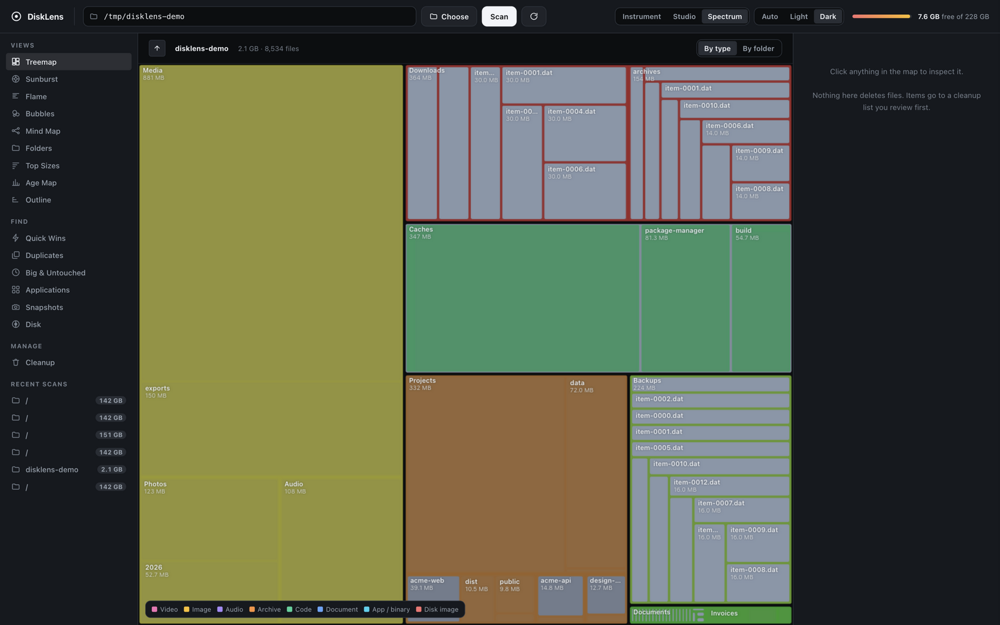
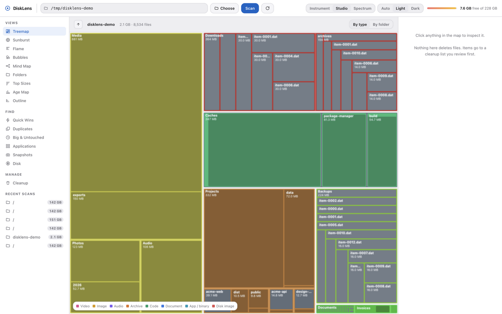

# DiskLens

A disk space analyzer that runs in your browser and tells you the truth about
your drive.

Point it at a folder, a volume, or the whole machine. It maps every byte, shows
the result nine different ways, finds duplicates by content, surfaces the files
you have not touched in a year, and — the part most tools skip — accounts for
the space it *could not* read, by name, so the numbers add up.

Python 3 and a browser. **No dependencies, no install step, no build.**

```bash
git clone https://github.com/shyamcxy/disklens.git
cd disklens
python3 server.py
```

That opens `http://127.0.0.1:8765/`. On first run it scans your whole Mac.


---

## Why another disk analyzer

Every other tool tells you what is big. This one also tells you what is
*missing from the total*, which is the question you actually hit when your disk
is full and the numbers do not reconcile:

```
Volume total (all APFS volumes)     container disk3      212 GB
  Files this scan read              everything it could  − 142 GB
  Other volumes                     Preboot, Recovery,   − 24.7 GB
                                    Update, VM
  Purgeable                         macOS reclaims itself − 1.0 GB
  Behind folders macOS blocks       960 folders          = 44.3 GB
```

Those lines sum to the volume total exactly. Click the figure in the header and
you get that derivation, drawn as a proportional bar and listed as arithmetic
you can check by eye.

Most tools report a gap like this as "other" or "system data" and move on. That
is how you end up staring at 64 GB you cannot account for.



## What it does

**Nine views over one scan.** Treemap, sunburst, flame, bubbles, mind map,
outline, folder table, top sizes, age map. Switching views does not re-scan —
the tree is already in memory, and each view requests only the shape it needs.

**Drill down by clicking.** One click on a folder goes into it; keep going as
deep as you like, with the breadcrumb and running total following you.
Right-click anything for Open, Reveal in Finder, Quick Look, Copy path, Stage,
and Move to Trash. Shift-click selects a folder without descending.

**Outline** is the folder-in-folder tracker: expand a row, expand the row inside
it, to any depth, with size and share-of-parent at every level and a stage
button on every row.

**Duplicates by content.** Size buckets first, then a hash of the first 64 KB,
then a full read only for the survivors. Files that merely share a name or a
size are rejected before anything expensive happens; files identical for the
first 64 KB that diverge later are still caught.

**Big & Untouched.** Files over a size threshold, unmodified for over a year,
ranked by what they would give back.

**Applications and their leftovers.** Every `.app` measured alongside the
caches, preferences, HTTP storage, saved state and logs it scattered across
`~/Library` — the part dragging an icon to the Trash leaves behind.

**Quick Wins.** Downloads, caches, logs, `node_modules`, build artifacts,
DerivedData and simulator images, totalled from the scan you already have.

**Snapshots.** Save a scan, compare it against a later one, see which folders
grew.

**Scans are kept.** A finished scan is written to disk and listed in the
sidebar. Reopening one is a file read, not a filesystem walk — a 94k-item scan
reopens in about 30 ms. Reload the page and you are back where you were; restart
the server and the list survives.

## Safety

Nothing is deleted behind your back, and the two-step is deliberate:

1. **Stage.** Pressing + puts an item on a list. Nothing on disk changes.
2. **Review.** The Cleanup page shows every staged path and size in one place.
3. **Run.** Only then does anything move, and it goes to the **Trash**, not into
   the void. A mistake is recoverable from the Finder.

Paths that must never be staged — your home folder, `/System`, `/usr`,
`~/Library/Keychains`, `~/Library/Mail`, `~/.ssh` and similar — are refused at
staging time, before the question is asked. The list lives in `store.py`.

**Deleting does not immediately free space.** Moving to the Trash leaves the
blocks allocated until you empty it, and macOS does not let a process list or
clear `~/.Trash` without Full Disk Access. DiskLens says so and gives you a
button to open the Trash, which is where the space actually comes back.

## Themes

Three directions, each with light and dark, switchable from the topbar and
remembered per browser. Defaults to following the system appearance.

| | |
|---|---|
| **Instrument** | Precise and technical. Near-monochrome, one accent, hairline rules. |
| **Studio** | Soft and spacious, shaped like macOS itself. |
| **Spectrum** | The data leads and the chrome disappears. |



Open **`/themes`** to see all six side by side, each panel being the real app
rather than a mockup. Every colour, radius and shadow comes from a token in
`web/theme.css`; `web/app.css` names no literal colour, so a new theme is a new
block of values and nothing else changes.

## Requirements

- **Python 3.9+** — standard library only. Verified on 3.14.
- A browser. Chrome, Safari, Firefox, Edge.
- macOS for the full feature set. See *Platform support* below.

Nothing to `pip install`. There is no `requirements.txt` because there are no
requirements.

## How it works

```
server.py      HTTP API, SSE scan progress, static files      (stdlib only)
scanner.py     parallel filesystem walker, flat-array tree
analysis.py    duplicates, age, quick wins, apps, disk accounting
store.py       scan registry, cleanup queue, snapshots, path protection
tools/
  volprobe.swift   reads APFS purgeable space, which no CLI exposes
web/
  index.html   the analyzer
  landing.html the marketing page
  themes.html  the theme comparison board
  viz.js       the nine layouts, on canvas
  app.js       app shell, state, panels, inspector
  theme.css    the theme token contract
  theme.js     theme resolution and persistence
  app.css      components, built entirely from tokens
```

Around 8,500 lines, about a third of it comments explaining *why*.

### Design notes

**The tree is arrays, not objects.** A two-million-file scan would be several
gigabytes as nested dicts. `scanner.py` stores it as parallel arrays (name,
parent, size, disk, mtime, flags, child links, counts), which keeps the same
scan in the low hundreds of megabytes.

**The walk is parallel and non-recursive.** Workers pull directories off a
shared queue rather than recursing, so a bounded pool never deadlocks on a deep
tree. `scandir` and `stat` release the GIL, so the per-file syscall that
dominates a scan overlaps across cores.

**Aggregation is one reverse pass.** A node's index is always lower than every
index beneath it, because a directory's entries are appended before its
subdirectories are enqueued. That single invariant replaces a recursive
roll-up.

**The browser never receives the whole tree.** The API sends `depth` levels and
the largest N children at each, folding the rest into an "N smaller items"
bucket that keeps totals honest, with a hard node budget on top.

**Derived views are computed in the background** as soon as a scan finishes, so
opening Quick Wins returns in about a millisecond rather than the twelve seconds
the walk costs cold. Concurrent callers share one in-flight computation instead
of each starting their own.

**Resident memory is bounded by bytes, not by count.** A whole-Mac scan of three
million nodes measures about 645 MB. Capping the number of scans would let five
of those reach 3 GB, so the registry keeps the resident set under a byte budget
and drops least-recently-used trees.

**Purgeable space is measured, not assumed.** No command-line tool on macOS
reports it. Foundation does, via `volumeAvailableCapacityForImportantUsage`
minus `volumeAvailableCapacity`, so `tools/volprobe.swift` is a twenty-line
probe compiled once on first use and cached. Without a Swift toolchain the
number is omitted rather than guessed.

### Measured behaviour

On an M-series MacBook (warm cache, APFS):

| Target | Items | On-disk | Time |
|---|---|---|---|
| `/Applications` | 94k | 12.5 GB | ~2 s |
| Home folder | 1.84M | 88.9 GB | ~43 s |
| `/` (entire Mac) | 3.00M | 162 GB | ~63 s |

## Platform support

Everything is built and tested on macOS, and several features are macOS-specific
by nature: APFS volume accounting, `.app` bundle and leftovers detection, the
Trash, and Finder integration.

The core — scanning, all nine views, duplicates, age map, Quick Wins, cleanup
staging — is plain Python and plain browser, and should work on Linux and
Windows. Those paths are untested, and the macOS-only panels simply report
nothing there. Patches welcome.

## API

The server is a small JSON API, so the UI is not the only client.

```
GET  /api/scans                       every scan, in memory or on disk
POST /api/scans/open {id}             load a saved scan back into memory
POST /api/scans/delete {id}           drop a scan and its saved tree

GET  /api/targets                     quick targets and mounted volumes
GET  /api/browse?path=                directory listing for the picker
GET  /api/volumes?path=               free/total/used for a volume

POST /api/scan {path, minSize, ...}   start a scan, returns {id}
GET  /api/scan/{id}/events            SSE: progress and status
GET  /api/scan/{id}/state             status snapshot
GET  /api/scan/{id}/tree?node&depth&maxChildren&maxNodes
GET  /api/scan/{id}/children?node=    all direct children
GET  /api/scan/{id}/node?i=           inspector detail
GET  /api/scan/{id}/top?node&n=       largest files
GET  /api/scan/{id}/age?node&buckets= bytes by last-modified time
GET  /api/scan/{id}/untouched?minBytes&minDays
GET  /api/scan/{id}/dupes?minBytes=   content-matched duplicate groups
GET  /api/scan/{id}/quickwins         caches, logs, build artifacts
GET  /api/scan/{id}/accounting        volume reconciliation

GET  /api/apps                        app bundles and leftover Library files
POST /api/reveal {path}               reveal in Finder
POST /api/open {path, quicklook}      open or Quick Look

GET  /api/cleanup                     staged queue
POST /api/cleanup/stage {items[]}     add to the queue (protected paths refused)
POST /api/cleanup/unstage {path}
POST /api/cleanup/run {useTrash}      execute the queue
GET  /api/trash                       the Trash, if macOS permits reading it
POST /api/trash/open                  open it in the Finder

GET  /api/snapshots                   saved scans
POST /api/snapshots {scanId, name}    save one
GET  /api/snapshots/{a}/compare/{b}   folder-level growth between two
```

## Security

A port on localhost is reachable by any web page you visit, so the server checks
where requests come from.

- **DNS rebinding.** An attacker points a domain they control at 127.0.0.1 and
  lures you to it; the browser then treats that domain and this server as the
  same origin, so CORS stops applying and their script can drive the whole API,
  including moving your files to the Trash. Every request must be addressed to a
  loopback name, which a rebinding request is not.
- **Cross-origin calls.** A non-loopback `Origin` is rejected. JSON bodies
  already force a CORS preflight this server does not answer, so most of this
  fails closed on its own; the check makes it explicit.

The server binds `127.0.0.1` by default and there is no authentication. Binding
`--host 0.0.0.0` exposes an unauthenticated API that can move files. Do not do
it on a network you do not control.

## Configuration

```
python3 server.py [--port 8765] [--host 127.0.0.1] [--no-browser]
./run.sh [port]        # picks a free port if the default is taken
```

Runtime data lives in `data/`: saved scans, the staged queue, snapshots, the
compiled probe. Delete it any time; nothing else depends on it.

## Limitations

Worth knowing before you rely on it.

- **Scanning is pure Python**, bounded by one `stat` syscall per file. It is
  parallel and comfortably beats a naive walk, but a native implementation using
  `getattrlistbulk` would be considerably faster. This is the obvious place for
  a contributor to make a large difference.
- **Duplicate hashing reads file contents.** On a whole-Mac scan that is real
  I/O and can take minutes.
- **Full Disk Access is required to see protected folders.** Without it your
  Photos library, Mail and Messages are invisible to *every* process — not just
  this one — and the accounting will say so. Grant it in System Settings →
  Privacy & Security.
- **macOS manages some of the gap and you cannot.** Swap, Preboot and Recovery
  are not reclaimable. The accounting names them so they stop being a mystery,
  not because you can delete them.
- **No background daemon.** Scans run while the page is open. Results are saved,
  so closing the tab costs you nothing but the live progress.
- **No automated test suite yet.** Behaviour has been verified by driving a real
  browser and by measuring the API, not by a test runner. Adding one is the
  highest-value contribution after native scanning.

## Contributing

Issues and pull requests welcome. A few things that would help most, roughly in
order:

1. A test suite. There is none, and it is the biggest gap.
2. Faster scanning via `getattrlistbulk` on macOS, or an equivalent bulk-stat
   path elsewhere.
3. Linux and Windows support for the platform-specific panels.
4. Accessibility: the visualisations are canvas-only and have no screen-reader
   or keyboard path.

Conventions: standard library only unless there is a strong reason, comments
that explain *why* rather than restating the code, and no cleverness in the
scanner's hot loop.

## License

**GNU AGPL-3.0-or-later** — see [LICENSE](LICENSE).

```
Copyright (C) 2026 DiskLens contributors

This program is free software: you can redistribute it and/or modify it under
the terms of the GNU Affero General Public License as published by the Free
Software Foundation, either version 3 of the License, or (at your option) any
later version.

This program is distributed in the hope that it will be useful, but WITHOUT ANY
WARRANTY; without even the implied warranty of MERCHANTABILITY or FITNESS FOR A
PARTICULAR PURPOSE. See the GNU Affero General Public License for more details.
```

Every source file carries an `SPDX-License-Identifier: AGPL-3.0-or-later` header,
so the licence is machine-readable per file.

In plain terms, because the choice matters if you are thinking of building on
this:

- **Use it, modify it, self-host it, share it.** No permission needed, no fee.
- **If you run a modified version as a network service, publish your changes.**
  That is the "Affero" part. It is what stops someone from taking DiskLens,
  closing the source and selling it back to you as a competing product.
- **Desktop use is unaffected.** Running it locally for yourself or inside your
  company carries no publishing obligation.

If AGPL does not work for your situation — some companies prohibit it outright —
open an issue and ask about a commercial license instead.
